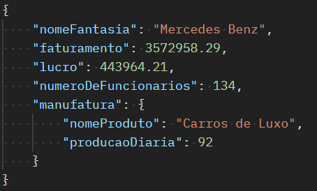
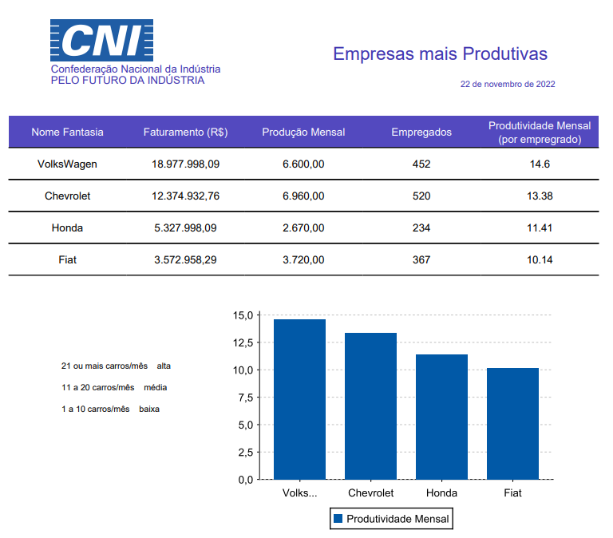
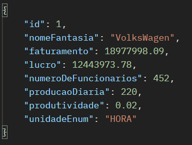

# Sistema Medidor de Produtividade das Indústrias Automotivas

## Desafio Técnico

Essa aplicação consiste em um mini sistema que calcula a produtividade de empresas montadoras de veículos.

As entidades Empresa e Manufatura possuem relacionamento **um para um**.

##### Tecnologias utilizadas
* Java 8
* Spring Boot
* H2 Database
* Jasper Reports
* Maven
* Docker

---

##### Como rodar localmente essa aplicação:

* Baixe o projeto;

* Na raiz do projeto, digite os seguintes comandos no terminal:
> mvn clean package
>
> docker build -t produtividade-app-backend .
>
> docker run -p 8080:8080 produtividade-app-backend
>
* Banco de dados relacional H2 em memória. Para acessar use:

> http://localhost:8080/h2-console/
>
* JDBC URL: jdbc:h2:mem:cni
* User Name: sa
* Password:

##### Observações

1 - Não é necessário indicar a senha.

2 - Existe uma carga default no banco com quatro empresas cadastradas para facilitar a visualização.

##### Navegação sugerida do sistema

* Criar uma empresa com manufatura aninhada, por exemplo:
> {
>    "nomeFantasia": "Mercedes Benz",
>    "faturamento": 3572958.29,
>    "lucro": 443964.21,
>    "numeroDeFuncionarios": 134,
>    "manufatura": {
>        "nomeProduto": "Carros de Luxo",
>        "producaoDiaria": 92
>    }
>}
>

##### Observação

1 - Manufatura é uma entidade fraca, ou seja, não possui existência própria. Ela necessariamente precisa 
estar vinculada a uma empresa e por esse motivo, ao remover uma empresa a respectiva manufatura também será 
deletada.

---

##### Detalhes importantes

O cálculo de produtividade é bem simples ( producaoDiaria / numeroDeFuncionarios ).

O sistema entrega o cálculo de 4 períodos de produtividade:
    
* horária
* diária
* mensal
* anual

Esses 4 fatores são aplicados ao cálculo anteriormente demonstrado.

O cálculo da produtividade foi feito sob o contrato de uma interface, o que permite a facilidade de manutenção
e também futuras implementações de diferentes cálculos.

O sistema exporta um relatório contendo o ranking das empresas mais produtivas, conforme exemplo abaixo:

---

### Endpoints API

#### Empresa:

#### GET
* Lista todas as empresas cadastradas
>localhost:8080/empresa
* Obtém uma empresa por id
>localhost:8080/empresa/{id}
* Obtém a produtividade de uma empresa por id e período
>localhost:8080/empresa/produtividade/{id}?periodo=mes
    
Parâmetros aceitos:
hora | dia | mes | ano

Retorno:

* Lista a produtividade mensal de todas as empresas cadastradas
>localhost:8080/empresa/produtividade-lista

* Exporta relatório de produtividade
>localhost:8080/empresa/produtividade-relatorio

#### POST
* Cadastra uma nova empresa
> localhost:8080/empresa

Exemplo JSON POST:

#### PUT
* Atualiza os dados de uma empresa
> localhost:8080/empresa/{id}

A entrada de dados pode ser semelhante ao exemplo da requisição POST.

#### DELETE
* Deleta uma dada empresa da base de dados
> localhost:8080/empresa/{id}

---

#### Manufatura:

#### GET
* Lista todas as manufaturas
>localhost:8080/manufatura
* Obtém uma manufatura por id
>localhost:8080/manufatura/{id}
